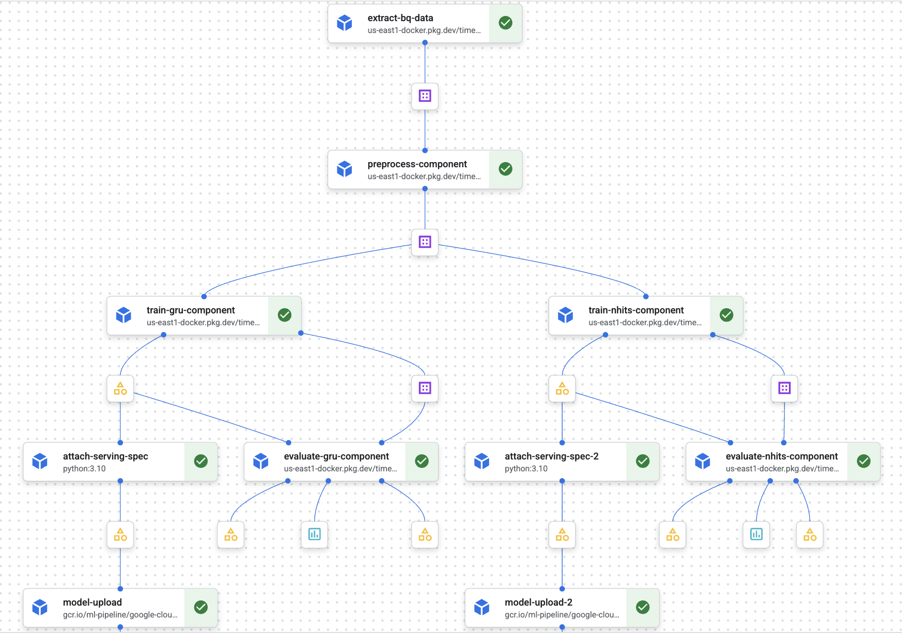

# ML Pipelines for Time Series Forecasting on Vertex AI
## Challenger/Champion ML Workflow with NHITS and GRU Models
This repo includes end to end pipelines for time series forecasting on Vertex AI.  The pipeline trains two models, to compete against eachother on the same dataset.  The first is a traditional RNN using a stacked and regularlized GRU architecture with TensorFlow and Keras.  The second is a N-HiTS model, which is a state of the art multi-stack MLP, that uses hierarchical interpolation and multi-rate sampling to handle different timescales, deployed with NeuralForecast.  The pipeline is designed to run on Vertex AI using Kubeflow Pipelines (KFP) and leverages GPU acceleration for model training.

<div align="center">
  
</div>

## Overview
The pipeline consists of the following steps:
1. **Extract**: Retrieve time series data from BigQuery 
2. **Preprocess**: Clean the data, remove outliers, engineer features from weather, rolling regime and trigonomic functions cos and sin
3. **Train**: Train both NHITS and GRU models using GPU
4. **Evaluate**: Assess model performance using Mean Absolute Error (MAE) on a test dataset, selecting the best model as the champion
5. **Attach Serving Spec**: Prepare the winning model for deployment with appropriate serving specifications
6. **Deploy**: Deploy the champion model to Vertex AI Model Registry for online predictions


The repo is nearly complete and is expected to finish before the end of DEC 2025.  Feel free to browse all the code and ask any questions.


## File Structure

```
nhits_gcp_workflow/
├── deploy_pipeline.sh                  # Shell script to deploy the Vertex AI pipeline
├── pipeline.py                         # Definition of the Vertex AI pipeline structure
├── README.md                           # Project overview and instructions
├── requirements.nhits.txt              # Python dependencies for NHITS training
├── requirements.txt                    # General Python dependencies for the project
├── submit_pipeline.py                  # Script to submit the pipeline job to Vertex AI
├── test_fix_locally.sh                 # Script to run local tests for the pipeline components
├── weather_data.csv                    # Dataset used for training/testing
├── docker/                             # Docker configuration files
│   ├── Dockerfile                      # Default Dockerfile for the project
│   ├── Dockerfile.local_test           # Dockerfile for local testing
│   ├── Dockerfile.nhits                # Dockerfile specifically for the NHITS model environment
│   └── Dockerfile.serving              # Dockerfile for the model serving container
├── docs/                               # Documentation files
│   ├── deep_learning_workspace.md
│   ├── deployment_blockers_summary.md
│   ├── deployment_guide.md
│   ├── prediction_pipeline_plan.md
│   └── STREAMING_GUIDE.md
├── images/                             # Images used in documentation
│   ├── forecasting_pipeline.png
│   ├── pipelines.png
│   └── vertexaipipelines.png
├── ingestion/                          # Data ingestion scripts
│   ├── ingest_feed.py
│   ├── mta-ingestion.service
│   └── requirements.txt
├── src/                                # Source code for pipeline components
│   ├── evaluate_gru.py                 # Component for evaluating GRU model
│   ├── evaluate_nhits.py               # Component for evaluating NHITS model
│   ├── extract.py                      # Component for data extraction
│   ├── prediction_utils.py             # Utility functions for making predictions
│   ├── preprocess.py                   # Component for data preprocessing
│   ├── serve.py                        # Code for serving the model
│   ├── train_gru.py                    # Training script for the GRU model
│   └── train_nhits.py                  # Training script for the NHITS model
├── streaming/                          # Streaming pipeline code
│   ├── pipeline.py
│   ├── prediction.py
│   ├── sink.py
│   ├── streaming_pipeline_v1.py
│   ├── test_transform.py
│   └── transform.py
└── training_and_preprocessing_workflows/ # Jupyter notebooks for experimentation
    ├── 39_neuralforecast.ipynb
    ├── full_clean_ml_datset.csv
    ├── ml_dataset_preprocessing.ipynb
    ├── ml_dec_17.csv
    ├── model_utils.py
    ├── nhits_training_workflow.ipynb
    ├── plot_timeseries.py
    ├── storage_key.json
    └── tensorflow_lstm_gru_workflow.ipynb
```
